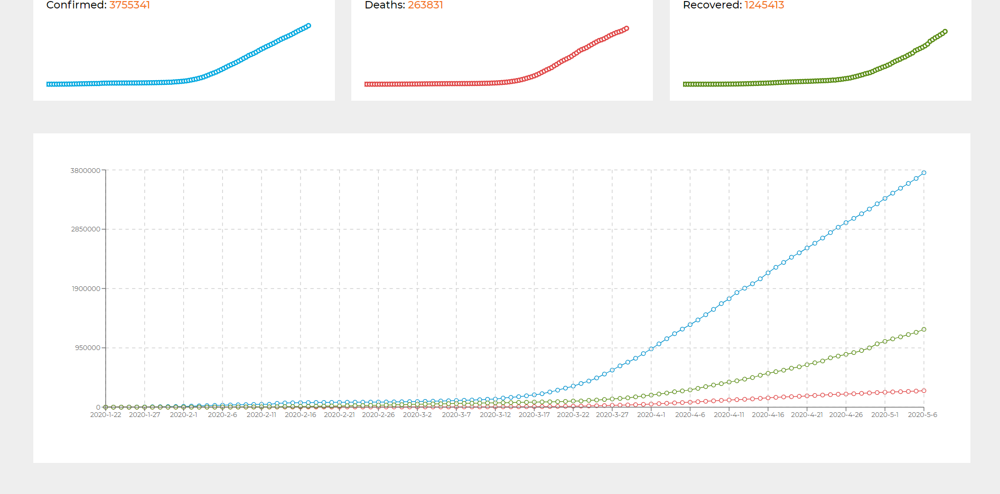

<!-- AUTO-GENERATED-CONTENT:START (STARTER) -->

<h2 align="center">
 Covid-19 tracker
</h2>


<h4>Demo screenshots</h4>





***

[Deployed App](https://distracted-wozniak-773de7.netlify.app/)

[API](https://github.com/pomber/covid19)
***

<h4>Project description</h4>


This project is a React application. This app uses styled components for styling. 
For managing state and async actions I used react hooks (useState, useEffect).
For fetching data from API I used [axios](https://github.com/axios/axios). 

 Application's logic is divided into several files. App.js is a root file. Another 
 components are nested in this component. When we open this app the Covid-19 statistics are presented.
 
When we enter countries the statistics from Poland are presented. We can also see statistics from 
another countries. The sidebar contains list of all countries from API. We can search through this list
by typing name of each country. After clicking on a country preview the statistics from selected country
are presented.

 

 
 

 


***
<h4>Technologies</h4>

1. ReactJs
2. Styled Components

***
<h4>Develop project</h4>


1.  **Start developing.**

    Navigate into your new site’s directory and start it up.

    ```shell
    cd covid19/
    npm start
    ```

1.  **Open the source code and start editing**

    App is now running at `http://localhost:3000/`

    
    
  ***

<h4>Project structure</h4>

A quick look at the top-level files and directories you'll see in a Gatsby project.

   
    ├── src
        ├── assets
            ├── img
            ├── reusable
                ├── components
                    ├── loader.js
            ├── styles
                ├── globalStyle.js
                ├── variables.js
            ├── APIURL.js
        ├── components
            ├── charts
            ├── countryInfo
                ├── countryInfoWrapper
                    ├── countryInfoWrapper.js
                ├── countryInfo.js
            ├── countryPreviewList
                ├── countryPreview
                    ├── countryPreview.js
                ├── countryPreviewWrapper
                    ├── countryPreviewWrapper.js
                ├── countryPreview.js
            ├── mainCountry
                ├── Info
                    ├── Info.js
                ├── mainCountryWrapper
                    ├── mainCountryWrapper.js
                ├── mainCountry.js
            ├── topBar
                ├── topBar.js
            ├── world
                ├── worldWrapper
                    ├── worldWrapperIntro
                        ├── worldWrapperIntro.js
                    ├── worldWrapper.js
                ├── world.js
        ├── pages
            ├── introPage.js
            ├── mainCountryPage.js
        
 


<!-- AUTO-GENERATED-CONTENT:END -->
